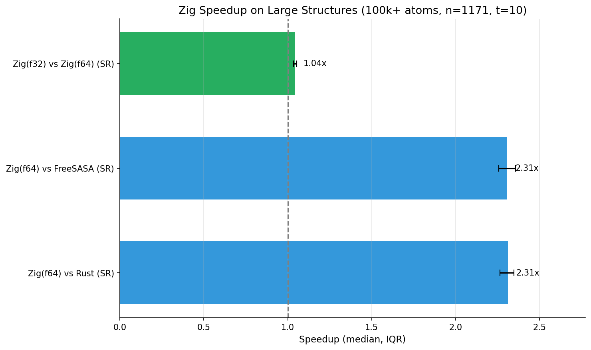
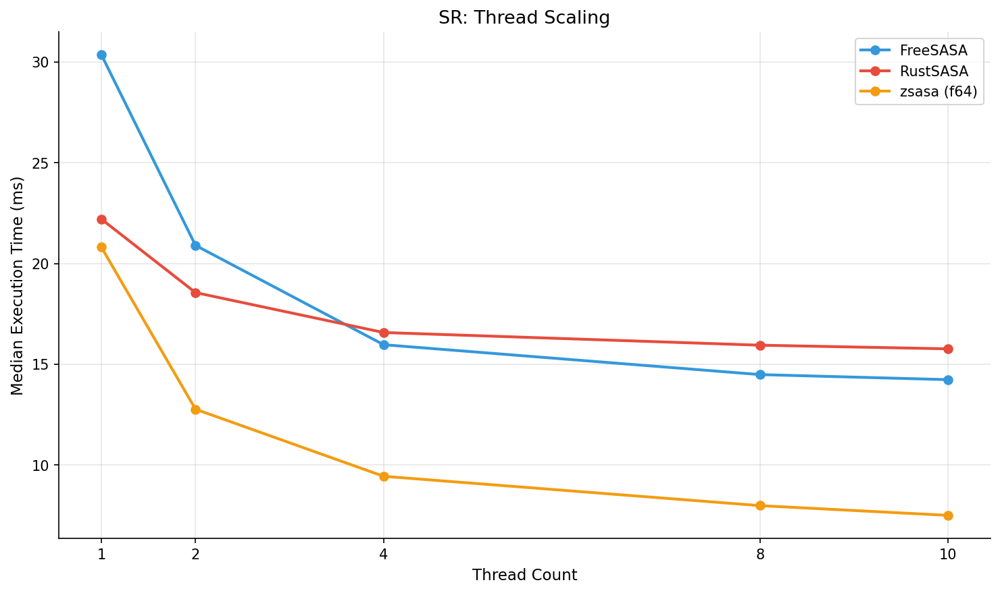
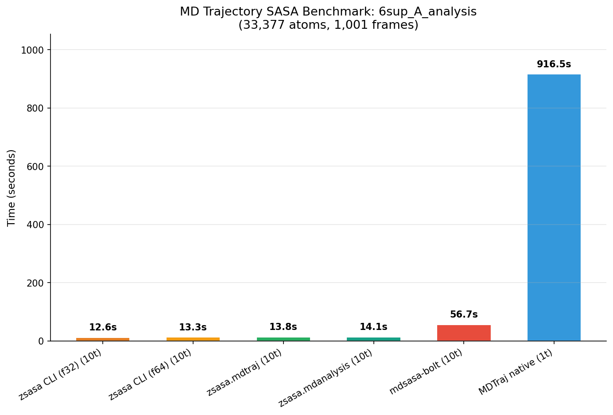

# zsasa

[](https://github.com/N283T/zsasa/actions/workflows/ci.yml)
[](https://pypi.org/project/zsasa/)
[](LICENSE)
[](https://ziglang.org/)
[](https://www.python.org/)

[English](README.md) | 日本語

Zig で実装された高性能 Solvent Accessible Surface Area (SASA) 計算ツール。
FreeSASA C より**最大3倍高速**、f64 精度を維持（[ベンチマーク](docs/benchmark/)）。

## 特徴

- **2つのアルゴリズム**: Shrake-Rupley（高速）と Lee-Richards（高精度）
- **複数の入力形式**: mmCIF, PDB, JSON
- **解析機能**: 残基単位集計、RSA、極性/非極性分類
- **高性能**: SIMD最適化、マルチスレッド、近傍リスト O(N)
- **クロスプラットフォーム**: Linux, macOS, Windows（`pip install zsasa` でビルド済みホイール利用可）
- **Python バインディング**: NumPy 連携、BioPython/Biotite/Gemmi 対応
- **MD トラジェクトリ解析**: ネイティブ XTC リーダー、MDTraj / MDAnalysis 連携

## クイックスタート

**必要環境**: Zig 0.15.2+ ([ダウンロード](https://ziglang.org/download/))

```bash
# ビルド
zig build -Doptimize=ReleaseFast

# 実行
./zig-out/bin/zsasa structure.cif output.json
```

## インストール

### CLI

```bash
git clone https://github.com/N283T/zsasa.git
cd zsasa
zig build -Doptimize=ReleaseFast
```

### Python

```bash
pip install zsasa
```

Linux (x86_64, aarch64), macOS (x86_64, arm64), Windows (x86_64) のビルド済みホイールを提供。
Python 3.11-3.13 対応。

開発用インストール（Zig 0.15.2+ が必要）:

```bash
cd python
pip install -e .
```

## 使い方

### CLI 例

```bash
# 基本的な SASA 計算
./zig-out/bin/zsasa structure.cif output.json

# Lee-Richards アルゴリズム
./zig-out/bin/zsasa --algorithm=lr structure.cif output.json

# マルチスレッド
./zig-out/bin/zsasa --threads=4 structure.cif output.json

# RSA 付き残基単位解析
./zig-out/bin/zsasa --rsa structure.cif output.json

# CSV 出力
./zig-out/bin/zsasa --format=csv structure.cif output.csv
```

### オプション

| オプション | 説明 | デフォルト |
|--------|-------------|---------|
| `--algorithm=ALGO` | `sr` (Shrake-Rupley) または `lr` (Lee-Richards) | sr |
| `--threads=N` | スレッド数 (0 = 自動) | auto |
| `--classifier=TYPE` | 原子分類器: `naccess`, `protor`, `oons` | - |
| `--chain=ID` | チェーン ID でフィルタ (例: `A` or `A,B,C`) | all |
| `--model=N` | NMR 構造のモデル番号 | all |
| `--per-residue` | 残基単位 SASA 集計を出力 | - |
| `--rsa` | 相対溶媒接触可能性を計算 | - |
| `--polar` | 極性/非極性サマリーを表示 | - |
| `--format=FMT` | 出力形式: `json`, `compact`, `csv` | json |
| `--probe-radius=R` | プローブ半径 (Å) | 1.4 |
| `--n-points=N` | 原子あたりのテストポイント数 (SR) | 100 |
| `--n-slices=N` | 原子あたりのスライス数 (LR) | 20 |
| `--precision=P` | `f32` (高速) または `f64` (高精度) | f64 |

全オプションは `./zig-out/bin/zsasa --help` を実行。詳細は [CLI リファレンス](docs/cli.md) を参照。

### Python 例

```python
import numpy as np
from zsasa import calculate_sasa

# SASA 計算
coords = np.array([[0.0, 0.0, 0.0], [3.0, 0.0, 0.0]])
radii = np.array([1.5, 1.5])
result = calculate_sasa(coords, radii)
print(f"Total: {result.total_area:.2f} Ų")
print(f"Per-atom: {result.atom_areas}")
```

構造ファイルを使用 (`pip install zsasa[gemmi]` が必要):

```python
from zsasa.integrations.gemmi import calculate_sasa_from_structure

result = calculate_sasa_from_structure("protein.cif")
print(f"Total: {result.total_area:.1f} Ų")
```

MD トラジェクトリを使用 (MDAnalysis):

```python
import MDAnalysis as mda
from zsasa.mdanalysis import SASAAnalysis

u = mda.Universe("topology.pdb", "trajectory.xtc")
sasa = SASAAnalysis(u, select="protein")
sasa.run()

print(f"Mean SASA: {sasa.results.mean_total_area:.2f} Ų")
print(f"Per-frame: {sasa.results.total_area}")
```

詳細は [Python API](docs/python-api/) を参照。

## 注意事項

- **標準アミノ酸のみ対応（CLI）**: 組み込み分類器（NACCESS, ProtOr, OONS）は標準アミノ酸と核酸の原子半径を提供します。非標準残基、リガンド等を計算する場合は、カスタム半径を指定した JSON 入力ファイルを使用してください（[CLI リファレンス](docs/cli.md) 参照）。
- **高度な原子選択**: CLI は基本的なフィルタリング（`--chain`, `--model`, `--include-hetatm`）に対応していますが、結合部位の残基選択や距離ベースの選択などの複雑な操作には、BioPython, Biotite, MDAnalysis 等と組み合わせた [Python バインディング](docs/python-api/) の利用を推奨します。

## ドキュメント

| ドキュメント | 説明 |
|----------|-------------|
| [CLI リファレンス](docs/cli.md) | コマンドラインオプション、入出力形式 |
| [Python API](docs/python-api/) | コア API、インテグレーション、MD トラジェクトリ対応 |
| [アルゴリズム](docs/algorithm.md) | Shrake-Rupley と Lee-Richards の詳細 |
| [分類器](docs/classifier.md) | NACCESS, ProtOr, OONS 原子分類器 |
| [最適化](docs/optimizations.md) | SIMD、スレッディング、パフォーマンス技術 |
| [ベンチマーク](docs/benchmark/) | 方法論と結果 |

## ベンチマーク

### 単一ファイル性能

| スピードアップ (threads=10) | スレッドスケーリング (100k+ atoms) |
|:--------------------:|:----------------------------:|
|  |  |

**主要結果 (100k+ atoms, threads=10):**
- FreeSASA/RustSASA 比で**2.3倍**の中央値スピードアップ
- スレッド数増加に伴いスピードアップ向上（優れた並列効率）

> **注**: Zig/FreeSASA は f64、RustSASA は f32 を使用。

詳細は [単一ファイルベンチマーク結果](docs/benchmark/single-file.md) を参照。

### MD トラジェクトリ性能

実際の MD トラジェクトリデータで mdsasa-bolt (RustSASA) より**4.3倍高速**。



*33,377 atoms, 1,001 frames, n_points=100*

## コントリビュート

開発セットアップとガイドラインは [CONTRIBUTING.md](CONTRIBUTING.md) を参照。

## ライセンス

[MIT](LICENSE)

## 参考文献

- Shrake, A.; Rupley, J. A. Environment and Exposure to Solvent of Protein Atoms. *J. Mol. Biol.* 1973, 79(2), 351–371. [doi:10.1016/0022-2836(73)90011-9](https://doi.org/10.1016/0022-2836(73)90011-9)
- Lee, B.; Richards, F. M. The Interpretation of Protein Structures: Estimation of Static Accessibility. *J. Mol. Biol.* 1971, 55(3), 379–400. [doi:10.1016/0022-2836(71)90324-x](https://doi.org/10.1016/0022-2836(71)90324-x)
- Mitternacht, S. FreeSASA: An Open Source C Library for Solvent Accessible Surface Area Calculations. *F1000Res.* 2016, 5, 189. [doi:10.12688/f1000research.7931.1](https://doi.org/10.12688/f1000research.7931.1)
- Campbell, M. J. RustSASA: A Rust Crate for Accelerated Solvent Accessible Surface Area Calculations. *J. Open Source Softw.* 2026, 11(117), 9537. [doi:10.21105/joss.09537](https://doi.org/10.21105/joss.09537)
