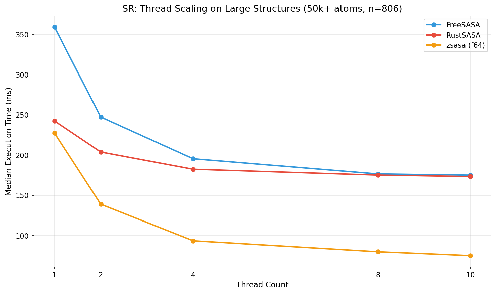

# zsasa

[](https://github.com/N283T/zsasa/actions/workflows/ci.yml)
[](https://pypi.org/project/zsasa/)
[](LICENSE)
[](https://ziglang.org/)
[](https://www.python.org/)

[日本語](README.ja.md) | English

High-performance Solvent Accessible Surface Area (SASA) calculator in Zig.
**Up to 3x faster** than FreeSASA C with f64 precision.

**[Documentation](https://n283t.github.io/zsasa/)**

## Features

- **Two algorithms**: Shrake-Rupley (fast) and Lee-Richards (precise)
- **Multiple input formats**: mmCIF, PDB, JSON
- **Analysis features**: Per-residue aggregation, RSA, polar/nonpolar classification
- **High performance**: SIMD optimization, multi-threading, neighbor list O(N)
- **Cross-platform**: Linux, macOS, and Windows (pre-built wheels via `pip install zsasa`)
- **Python bindings**: NumPy integration with BioPython/Biotite/Gemmi support
- **MD trajectory analysis**: Native XTC reader, MDTraj and MDAnalysis integration

## Quick Start

### Python

```bash
pip install zsasa
# or
uv add zsasa
```

```python
import numpy as np
from zsasa import calculate_sasa

coords = np.array([[0.0, 0.0, 0.0], [3.0, 0.0, 0.0]])
radii = np.array([1.5, 1.5])
result = calculate_sasa(coords, radii)
print(f"Total SASA: {result.total_area:.2f} Ų")
```

### CLI

Requires [Zig 0.15.2+](https://ziglang.org/download/).

```bash
git clone https://github.com/N283T/zsasa.git
cd zsasa && zig build -Doptimize=ReleaseFast
./zig-out/bin/zsasa calc structure.cif output.json
```

## Benchmarks

### Single-File Performance

| Speedup (threads=10) | Thread Scaling (50k+ atoms) |
|:--------------------:|:----------------------------:|
|  |  |

**Key Results (50k+ atoms, threads=10):**
- **2.3x** median speedup vs FreeSASA and RustSASA (SR)
- Speedup increases with thread count (superior parallel efficiency)

> **Note**: zsasa/FreeSASA use f64, RustSASA uses f32.

### MD Trajectory Performance

**4.3x faster** than mdsasa-bolt (RustSASA) on real MD trajectory data.


*33,377 atoms, 1,001 frames, n_points=100*

See [benchmark details](https://n283t.github.io/zsasa/benchmarks/single-file) for full methodology and results.

## Documentation

Full documentation is available at **[n283t.github.io/zsasa](https://n283t.github.io/zsasa/)**.

| Section | Description |
|---------|-------------|
| [Getting Started](https://n283t.github.io/zsasa/getting-started) | Installation and first calculation |
| [CLI Reference](https://n283t.github.io/zsasa/cli) | Full CLI options and output formats |
| [Python API](https://n283t.github.io/zsasa/python-api) | Core API, integrations, MD trajectory |
| [Benchmarks](https://n283t.github.io/zsasa/benchmarks/single-file) | Methodology and results |

## Contributing

See [CONTRIBUTING.md](CONTRIBUTING.md) for development setup and guidelines.

## License

[MIT](LICENSE)

## References

- Shrake, A.; Rupley, J. A. Environment and Exposure to Solvent of Protein Atoms. *J. Mol. Biol.* 1973, 79(2), 351-371. [doi:10.1016/0022-2836(73)90011-9](https://doi.org/10.1016/0022-2836(73)90011-9)
- Lee, B.; Richards, F. M. The Interpretation of Protein Structures: Estimation of Static Accessibility. *J. Mol. Biol.* 1971, 55(3), 379-400. [doi:10.1016/0022-2836(71)90324-x](https://doi.org/10.1016/0022-2836(71)90324-x)
- Mitternacht, S. FreeSASA: An Open Source C Library for Solvent Accessible Surface Area Calculations. *F1000Res.* 2016, 5, 189. [doi:10.12688/f1000research.7931.1](https://doi.org/10.12688/f1000research.7931.1)
- Campbell, M. J. RustSASA: A Rust Crate for Accelerated Solvent Accessible Surface Area Calculations. *J. Open Source Softw.* 2026, 11(117), 9537. [doi:10.21105/joss.09537](https://doi.org/10.21105/joss.09537)
