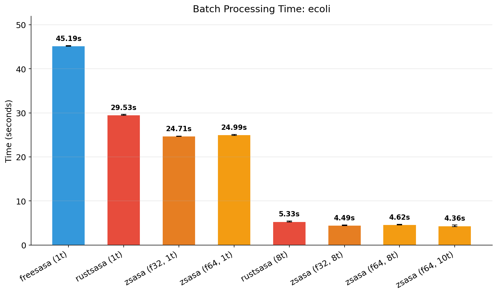
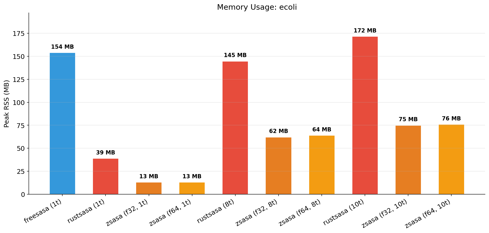
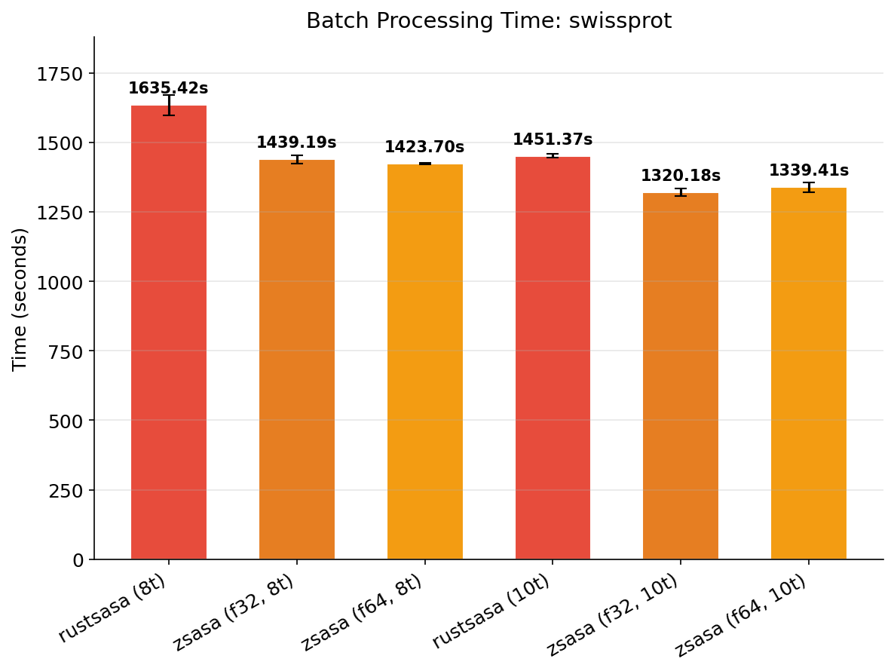
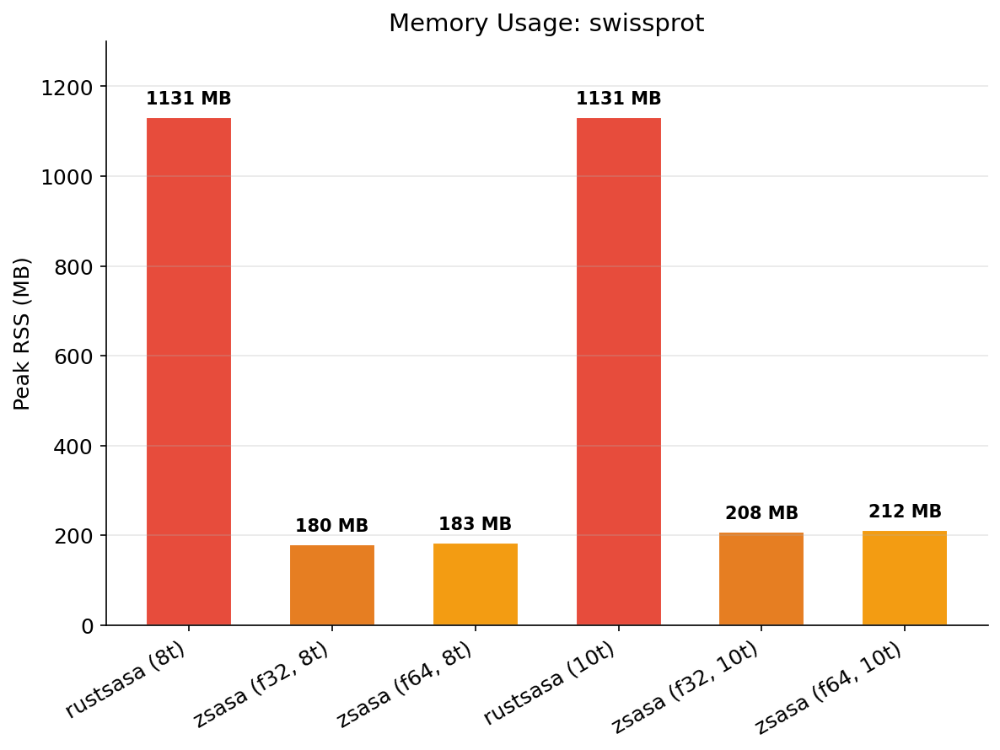

# Batch Processing Benchmarks

Throughput benchmarks for processing complete datasets using [hyperfine](https://github.com/sharkdp/hyperfine) timing.

> **Note**: This measures total wall-clock time for processing an entire directory of PDB files with native multi-threading.

## Test Environment

| Item | Value |
|------|-------|
| Machine | MacBook Pro |
| Chip | Apple M4 (10 cores: 4P + 6E) |
| Memory | 32 GB |
| OS | macOS |

## Results

### E. coli Proteome (4,370 structures)

Dataset: AlphaFold E. coli K-12 proteome (UP000000625_83333_ECOLI_v6), PDB format.

Benchmark parameters: warmup=3, runs=5, threads=8

| Tool | Threads | Time (s) | Std Dev | vs FreeSASA | vs RustSASA |
|------|--------:|--------:|--------:|------------:|------------:|
| **zsasa f32** | **8** | **4.263** | ±0.042 | **10.5x** | **1.26x** |
| **zsasa f64** | **8** | **4.532** | ±0.185 | **9.9x** | **1.18x** |
| RustSASA | 8 | 5.359 | ±0.065 | 8.4x | - |
| **zsasa f32** | **1** | **24.099** | ±0.769 | **1.86x** | **1.31x** |
| zsasa f64 | 1 | 26.184 | ±0.163 | 1.72x | 1.21x |
| RustSASA | 1 | 31.618 | ±0.153 | 1.42x | - |
| FreeSASA | 1 | 44.923 | ±0.057 | baseline | - |

**Key findings:**

- **8-thread**: zsasa f32 is **10.5x faster** than FreeSASA, **1.26x faster** than RustSASA
- **Single-thread**: zsasa f32 is **1.86x faster** than FreeSASA, **1.31x faster** than RustSASA
- **Parallel scaling (1t→8t)**: zsasa f32 5.65x, zsasa f64 5.78x, RustSASA 5.90x





### SwissProt (550,122 structures)

Dataset: SwissProt PDB v6, PDB format. 8-thread only (FreeSASA omitted due to dataset size).

Benchmark parameters: warmup=3, runs=3, threads=8

| Tool | Threads | Time (s) | Std Dev | vs RustSASA |
|------|--------:|--------:|--------:|------------:|
| **zsasa f32** | **8** | **1487.1** (24.8 min) | ±24.4 | **1.09x** |
| **zsasa f64** | **8** | **1496.1** (24.9 min) | ±20.6 | **1.08x** |
| RustSASA | 8 | 1617.1 (27.0 min) | ±6.3 | baseline |

**Key findings:**

- zsasa processes **550K structures in ~25 minutes** (8 threads)
- zsasa f32 is **130 seconds faster** than RustSASA (8.0% improvement)
- zsasa uses **~180 MB** RSS vs RustSASA's **~1.13 GB** (6x less memory)





## Methodology

Uses [hyperfine](https://github.com/sharkdp/hyperfine) for timing, following the [RustSASA paper](https://github.com/OWissett/rustsasa) methodology:

1. Warmup runs (default 3) to eliminate cold-start effects
2. Multiple timed runs for statistical reliability
3. Reports mean, stddev, min, max

### Tool Configurations

| Tool | Configurations |
|------|----------------|
| zsasa (Zig) | f64 Nt, f64 1t, f32 Nt, f32 1t |
| FreeSASA | 1t only (sequential batch wrapper) |
| RustSASA | Nt, 1t |

### Notes

1. **Input format**: All tools use PDB input for fair comparison. zsasa supports JSON input which would be faster.
2. **FreeSASA limitation**: FreeSASA CLI only supports single-threaded batch processing. A custom wrapper (`sasa_batch.cpp`) processes files sequentially.
3. **SwissProt scope**: FreeSASA and single-thread baselines omitted due to dataset size.

## Running Benchmarks

```bash
# E. coli proteome
./benchmarks/scripts/batch_bench.py \
  -i benchmarks/UP000000625_83333_ECOLI_v6/pdb \
  -n ecoli --runs 5 --threads 8

# SwissProt (large dataset)
./benchmarks/scripts/batch_bench.py \
  -i /path/to/swissprot_pdb_v6 \
  -n swissprot --runs 3 --threads 8 --skip-1t

# Single tool only
./benchmarks/scripts/batch_bench.py \
  -i /path/to/pdb_dir -n my-bench --tool zig

# Dry run
./benchmarks/scripts/batch_bench.py \
  -i /path/to/pdb_dir -n test --dry-run
```

### Options

| Option | Description | Default |
|--------|-------------|---------|
| `--input`, `-i` | Input directory (PDB files) | (required) |
| `--name`, `-n` | Benchmark name | (required) |
| `--threads`, `-T` | Thread count for multi-threaded runs | 8 |
| `--runs`, `-r` | Number of benchmark runs | 3 |
| `--warmup`, `-w` | Number of warmup runs | 3 |
| `--tool`, `-t` | Tool: zig, freesasa, rustsasa, all | all |
| `--skip-1t` | Skip single-thread baselines | false |
| `--output`, `-o` | Output directory | results/batch/\<name\> |
| `--dry-run` | Show commands without running | false |

### Analysis

```bash
./benchmarks/scripts/analyze_batch.py summary           # All benchmarks
./benchmarks/scripts/analyze_batch.py summary -n ecoli  # Specific benchmark
./benchmarks/scripts/analyze_batch.py plot -n ecoli     # Time comparison chart
./benchmarks/scripts/analyze_batch.py memory -n ecoli   # Memory comparison chart
./benchmarks/scripts/analyze_batch.py all               # Summary + all charts
```

## Related Documents

- [methodology.md](methodology.md) - Benchmark methodology
- [results.md](results.md) - Single-file benchmark results
