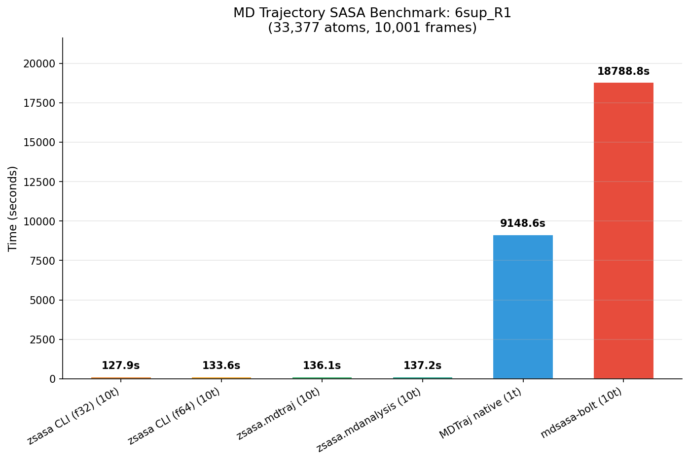
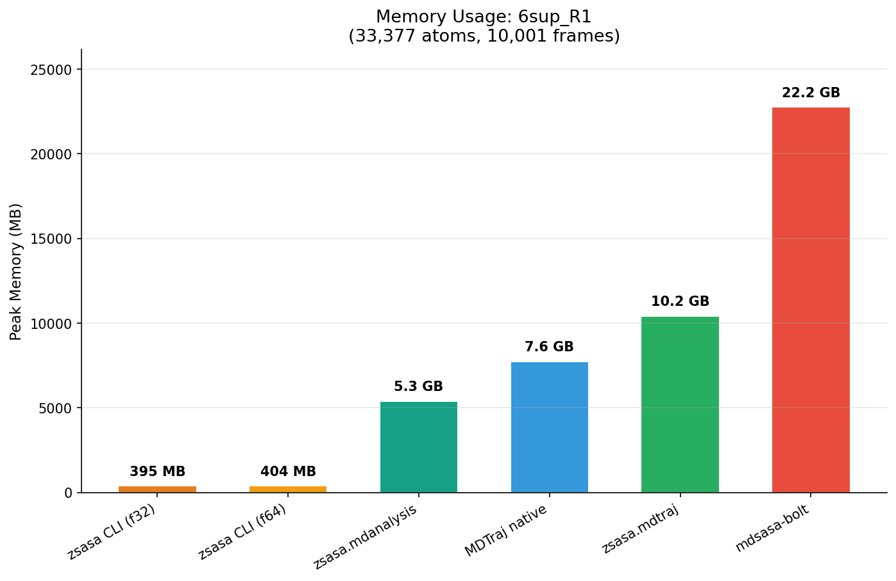

# MD Trajectory SASA Benchmarks

Performance comparison of SASA calculation on molecular dynamics trajectories.

## Implementations

| Tool | Language | Threading | I/O | Notes |
|------|----------|-----------|-----|-------|
| **zsasa CLI** | Zig | Configurable | Native XTC reader | f32/f64 precision, streams frames |
| **zsasa.mdtraj** | Python/Zig | Configurable | MDTraj (C) | MDTraj loads trajectory, zsasa computes SASA |
| **zsasa.mdanalysis** | Python/Zig | Configurable | MDAnalysis | MDAnalysis loads trajectory, zsasa computes SASA |
| **MDTraj** | Python/C | Single-threaded | MDTraj (C) | `shrake_rupley`, no parallel option |
| **mdsasa-bolt** | Rust | All cores (rayon) | MDAnalysis/Python | RustSASA via Python bridge |

## Test Environment

| Item | Value |
|------|-------|
| Machine | MacBook Pro |
| Chip | Apple M4 (10 cores: 4P + 6E) |
| Memory | 32 GB |
| OS | macOS |

## Results

### 6sup_A_analysis (Large: 33,377 atoms, 1,001 frames)

Benchmark parameters: warmup=1, runs=3, n_points=100, threads=8,10

Results at 10 threads (MDTraj: 1t, mdsasa-bolt: all cores):

| Tool | Threads | Time (s) | FPS | vs MDTraj | vs mdsasa-bolt | RSS |
|------|--------:|--------:|----:|----------:|---------------:|----:|
| **zsasa CLI (f32)** | **10** | **12.62** | **79** | **72.6x** | **4.5x** | **394 MB** |
| zsasa CLI (f64) | 10 | 13.27 | 75 | 69.0x | 4.3x | 402 MB |
| zsasa.mdtraj | 10 | 13.83 | 72 | 66.3x | 4.1x | 1.2 GB |
| zsasa.mdanalysis | 10 | 14.09 | 71 | 65.1x | 4.0x | 807 MB |
| mdsasa-bolt | all | 56.70 | 18 | 16.2x | baseline | 10.9 GB |
| MDTraj | 1 | 916.51 | 1.1 | baseline | - | 871 MB |

**Observations:**
- zsasa CLI (f32) is **73x faster** than MDTraj, **4.5x faster** than mdsasa-bolt
- SASA computation dominates over I/O: zsasa CLI now beats zsasa.mdtraj
- All zsasa variants within 12% of each other (SASA engine is the same)
- mdsasa-bolt uses **10.9 GB** RAM vs zsasa CLI's **394 MB** (28x difference)


### 6sup_R1 (Large: 33,377 atoms, 10,001 frames)

Benchmark parameters: warmup=1, runs=3, n_points=100, threads=1,8,10

Results at 10 threads (MDTraj: 1t, mdsasa-bolt: all cores):

| Tool | Threads | Time (s) | FPS | vs MDTraj | vs mdsasa-bolt | RSS |
|------|--------:|--------:|----:|----------:|---------------:|----:|
| **zsasa CLI (f32)** | **10** | **127.9** | **78** | **71.5x** | **146.9x** | **395 MB** |
| zsasa CLI (f64) | 10 | 133.6 | 75 | 68.5x | 140.6x | 404 MB |
| zsasa.mdtraj | 10 | 136.1 | 74 | 67.2x | 138.1x | 10.2 GB |
| zsasa.mdanalysis | 10 | 137.2 | 73 | 66.7x | 136.9x | 5.3 GB |
| MDTraj | 1 | 9,148.6 | 0.1 | baseline | 2.1x | 7.6 GB |
| mdsasa-bolt | all | 18,788.8 | 0.05 | 0.49x | baseline | 22.1 GB |

**Observations:**
- zsasa CLI (f32) processes **10k frames in 2.1 minutes** (78 FPS)
- **mdsasa-bolt is 2x slower than MDTraj** on 10k frames (see [Performance Degradation](#mdsasa-bolt-performance-degradation))
- zsasa CLI is **147x faster** than mdsasa-bolt
- zsasa CLI uses **395 MB** vs mdsasa-bolt's **22.1 GB** (56x difference)



## Key Findings

### zsasa CLI vs MDTraj

| Dataset | Atoms | Frames | zsasa CLI (10t) | MDTraj (1t) | Speedup |
|---------|------:|-------:|--------:|--------:|--------:|
| 6sup_A_analysis | 33,377 | 1,001 | 12.62s | 916.51s | 72.6x |
| 6sup_R1 | 33,377 | 10,001 | 127.9s | 9,148.6s | 71.5x |

- MDTraj's `shrake_rupley` is single-threaded and lacks SIMD optimization

### zsasa CLI vs mdsasa-bolt

| Dataset | Atoms | Frames | zsasa CLI (10t) | mdsasa-bolt (all) | Speedup |
|---------|------:|-------:|--------:|--------:|--------:|
| 6sup_A_analysis | 33,377 | 1,001 | 12.62s | 56.70s | 4.5x |
| 6sup_R1 | 33,377 | 10,001 | 127.9s | 18,788.8s | 146.9x |

- mdsasa-bolt degrades severely with frame count (4.5x -> 147x gap)
- On 10k frames, mdsasa-bolt is slower than single-threaded MDTraj

### zsasa CLI vs Python Bindings

| Dataset | zsasa CLI (f32, 10t) | zsasa.mdtraj (10t) | zsasa.mdanalysis (10t) |
|---------|--------:|--------:|--------:|
| 6sup_A_analysis | **12.62s** | 13.83s | 14.09s |
| 6sup_R1 | **127.9s** | 136.1s | 137.2s |

- zsasa CLI wins by 6-8% over Python bindings (native XTC reader + streaming)
- All use the same SASA computation engine

## Memory Usage

| Tool | 6sup_A (33k atoms, 1k fr) | 6sup_R1 (33k atoms, 10k fr) |
|------|---:|---:|
| zsasa CLI | 394 MB | 395 MB |
| zsasa.mdtraj | 1.2 GB | 10.2 GB |
| zsasa.mdanalysis | 807 MB | 5.3 GB |
| MDTraj | 871 MB | 7.6 GB |
| mdsasa-bolt | 10.9 GB | 22.1 GB |

**Key observations:**
- **zsasa CLI** memory is constant with frame count (~395 MB for 33k atoms regardless of 1k or 10k frames) because it streams frames
- **Python tools** scale linearly with frame count (entire trajectory loaded into memory)
- **mdsasa-bolt** has the highest memory usage: 22 GB for 10k frames of a 33k-atom system



## mdsasa-bolt Performance Degradation

mdsasa-bolt's performance degrades dramatically as frame count increases: 4.5x slower than zsasa on 1k frames, but 147x slower on 10k frames. The exact cause is unclear, but memory usage data suggests a memory efficiency issue — mdsasa-bolt consumes **22.1 GB** for 10k frames of a 33k-atom system, compared to zsasa CLI's **395 MB**. On 10k frames, mdsasa-bolt becomes slower than even single-threaded MDTraj.

## Running Benchmarks

```bash
# Run benchmark
./benchmarks/scripts/bench_md.py \
    --xtc trajectory.xtc \
    --pdb topology.pdb \
    --name my_bench \
    --threads "1,4,8,10"

# Specific tools only
./benchmarks/scripts/bench_md.py \
    --xtc trajectory.xtc \
    --pdb topology.pdb \
    --name my_bench \
    --tool zig --tool zsasa_mdtraj
```

### Options

| Option | Description | Default |
|--------|-------------|---------|
| `--xtc` | XTC trajectory file | (required) |
| `--pdb` | Topology PDB file | (required) |
| `--name`, `-n` | Benchmark name | (required) |
| `--threads`, `-T` | Thread counts: `1,4,8` or `1-10` | `1,8` |
| `--runs`, `-r` | Number of benchmark runs | 3 |
| `--warmup`, `-w` | Number of warmup runs | 1 |
| `--stride`, `-s` | Frame stride | 1 |
| `--n-points` | Test points per atom | 100 |
| `--tool`, `-t` | Tool: zig, zsasa_mdtraj, zsasa_mdanalysis, mdtraj, mdsasa_bolt (repeatable) | all |
| `--output`, `-o` | Output directory | results/md/\<name\> |
| `--dry-run` | Show commands without running | false |

### Analysis

```bash
./benchmarks/scripts/analyze_md.py all --name my_bench       # All plots + summary
./benchmarks/scripts/analyze_md.py summary --name my_bench   # Summary table
./benchmarks/scripts/analyze_md.py bar --name my_bench       # Tool comparison
./benchmarks/scripts/analyze_md.py memory --name my_bench    # Memory usage
```

## Notes

- All implementations use 100 test points per atom (Shrake-Rupley algorithm)
- Times include trajectory loading and SASA calculation
- mdsasa-bolt "all" = 10 threads on this system
- f32 and f64 precision produce nearly identical timing (~3-5% difference)
- SASA accuracy and XTC reader consistency validated in [validation.md](validation.md)

## Related Documents

- [single-file.md](single-file.md) - Single-file benchmark results
- [batch.md](batch.md) - Batch processing benchmarks
- [validation.md](validation.md) - SASA accuracy validation
