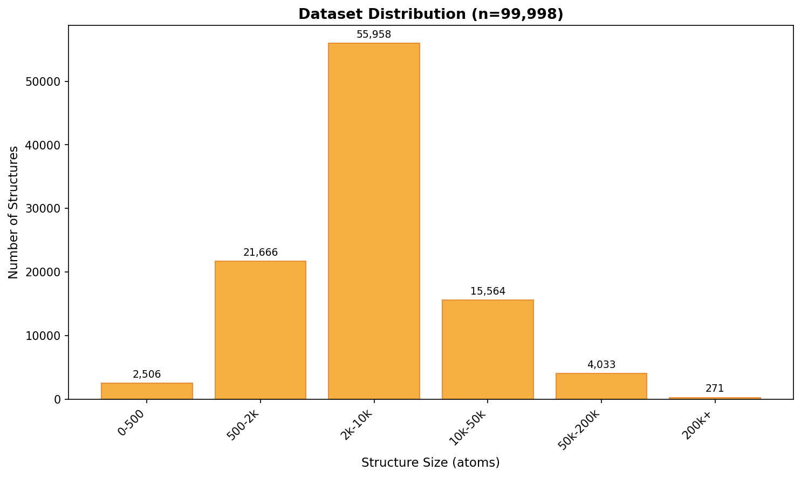
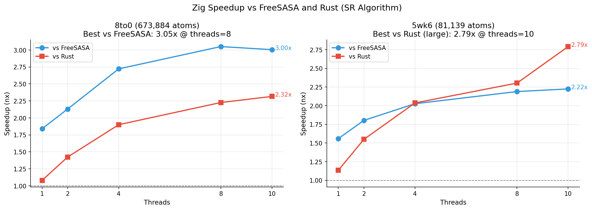
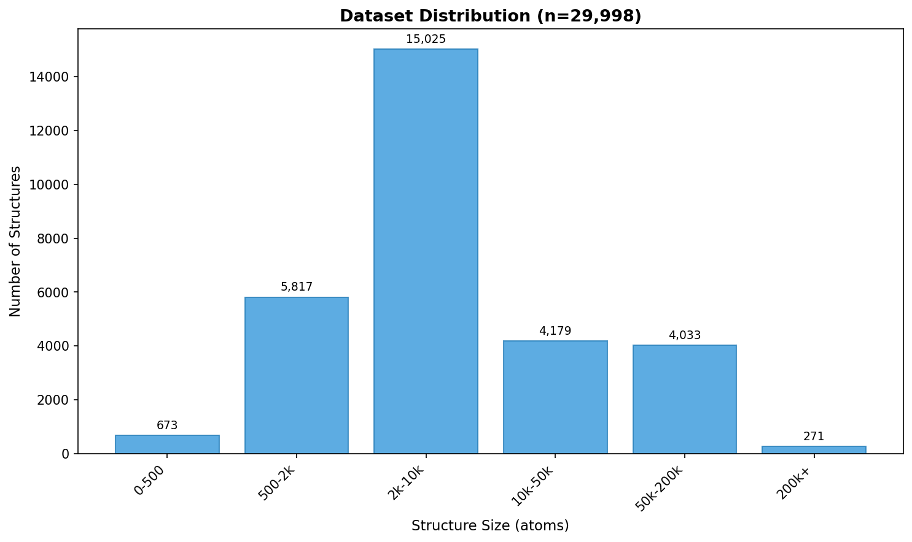

# Benchmark Results

Large-scale benchmark results for freesasa-zig using Shrake-Rupley algorithm.

- **Dataset**: ~100k structures (stratified sampling from PDB)
- **Precision**: Zig/FreeSASA use f64, RustSASA uses f32

## Highlights

Zig's key advantage: **Large structures + Multi-threading**

| Speedup at threads=10 | Thread Scaling (100k+ atoms) |
|:---------------:|:----------------------------:|
|  |  |

**Key Results (100k+ atoms, n=1,171):**
- **2.3x** faster than FreeSASA and RustSASA (threads=10)
- Speedup increases with thread count (parallel efficiency advantage)

---

## Test Environment

| Item | Value |
|------|-------|
| Machine | MacBook Pro |
| Chip | Apple M4 |
| Cores | 10 (4 performance + 6 efficiency) |
| Memory | 32 GB |
| OS | macOS |

## Executive Summary

| Metric | Zig vs FreeSASA | Zig vs RustSASA |
|--------|-----------------|-----------------|
| **Overall (threads=10)** | **1.45x** median | **2.07x** median |
| **Large structures (100k+)** | **2.3x** | **2.3x** |
| **Largest structure (4.5M atoms)** | **2.9x** | **2.2x** |
| **Parallel efficiency (threads=10)** | **+30%** | **+93%** |
| **Instruction count** | **2.4x fewer** | Comparable |

---

## Dataset



| Sampling Bin | Size Bin | Atoms | Count | Percentage |
|:------------:|----------|------:|------:|-----:|
| 0-500 | 0-500 | 0-500 | 2,506 | 2.5% |
| 500-2k | 500-1k | 500-1,000 | 5,744 | 5.7% |
| ↓ | 1k-2k | 1,000-2,000 | 15,922 | 15.9% |
| 2k-10k | 2k-5k | 2,000-5,000 | 36,123 | 36.1% |
| ↓ | 5k-10k | 5,000-10,000 | 19,835 | 19.8% |
| 10k-50k | 10k-20k | 10,000-20,000 | 10,187 | 10.2% |
| ↓ | 20k-50k | 20,000-50,000 | 5,377 | 5.4% |
| 50k-200k | 50k-100k | 50,000-100,000 | 3,133 | 3.1% |
| ↓ | 100k-200k | 100,000-200,000 | 900 | 0.9% |
| 200k+ | 200k+ | 200,000+ | 271 | 0.3% |
| | **Total** | | **99,998** | |

- **Source**: All structures from the Protein Data Bank (PDB)
- **Sampling**: Stratified sampling (seed 42)
- **Large structures**: 50k+ atoms are all included (due to rarity)

---

## Single-Thread Performance (threads=1)

Single-threaded comparison (excluding parallelization effects):

| Size Bin | vs FreeSASA | vs RustSASA |
|----------|------------:|------------:|
| 0-500 | 0.95x | 0.74x |
| 500-1k | 0.99x | 0.79x |
| 1k-2k | 1.04x | 0.82x |
| 2k-5k | 1.13x | 0.86x |
| 5k-10k | 1.24x | 0.93x |
| 10k-20k | 1.35x | 1.01x |
| 20k-50k | 1.48x | 1.09x |
| 50k-100k | **1.56x** | 1.10x |
| 100k-200k | **1.60x** | 1.11x |
| 200k+ | **1.60x** | 1.13x |

**Observations:**
- Zig vs FreeSASA: **1.6x** on large structures (SIMD optimization)
- Zig vs Rust: Nearly equal (both use SIMD)

---

## Multi-Thread Performance (threads=10)

### Overall Statistics

| Tool | Structures | Median (ms) | Mean (ms) | P95 (ms) |
|------|----------:|------------:|----------:|---------:|
| **Zig** | 99,998 | **3.24** | 7.78 | 28.91 |
| FreeSASA | 99,998 | 4.69 | 14.53 | 57.06 |
| RustSASA | 99,998 | 5.60 | 15.68 | 60.39 |

### Speedup by Structure Size


| Size Bin | Count | vs FreeSASA | vs RustSASA |
|----------|------:|------------:|------------:|
| 0-500 | 2,506 | 0.92x | 0.97x |
| 500-1k | 5,744 | 1.18x | 1.36x |
| 1k-2k | 15,922 | 1.26x | 1.54x |
| 2k-5k | 36,123 | 1.42x | 1.70x |
| 5k-10k | 19,835 | 1.56x | 1.84x |
| 10k-20k | 10,187 | 1.68x | 1.95x |
| 20k-50k | 5,377 | 1.93x | 2.11x |
| 50k-100k | 3,133 | **2.22x** | **2.25x** |
| 100k-200k | 900 | **2.31x** | **2.30x** |
| 200k+ | 271 | **2.28x** | **2.34x** |

**Observations:**
- **Small (0-500)**: Overhead dominant, no speedup
- **Medium (1k-20k)**: Stable **1.3x-1.9x** speedup
- **Large (50k+)**: Up to **2.3x** speedup with consistent results (narrow IQR)

**Key Insight:**
- At threads=1, Zig vs Rust is nearly equal
- At threads=10, Zig takes a significant lead → **parallel efficiency difference**

---

## Thread Scaling

### Median Execution Time by Thread Count


| Threads | Zig (ms) | FreeSASA (ms) | Rust (ms) |
|--------:|---------:|--------------:|----------:|
| 1 | 8.93 | 10.09 | 7.71 |
| 2 | 5.64 | 6.93 | 6.48 |
| 4 | 3.98 | 5.17 | 5.85 |
| 8 | 3.39 | 4.81 | 5.62 |
| 10 | **3.24** | 4.69 | 5.60 |

**Speedup from threads=1 to threads=10:**
- Zig: 8.93 → 3.24 = **2.76x**
- FreeSASA: 10.09 → 4.69 = **2.15x**
- Rust: 7.71 → 5.60 = **1.38x**

---

## Parallel Efficiency

### Definition

```
Parallel Efficiency = T1 / (TN × N)
```

- T1 = Single-thread execution time
- TN = N-thread execution time
- 1.0 = Ideal linear scaling

### Efficiency by Thread Count


| Threads | Zig | FreeSASA | Rust | Zig vs FS | Zig vs Rust |
|--------:|----:|---------:|-----:|----------:|------------:|
| 1 | 1.000 | 1.000 | 1.000 | - | - |
| 2 | 0.792 | 0.728 | 0.595 | **+9%** | **+33%** |
| 4 | 0.561 | 0.488 | 0.330 | **+15%** | **+70%** |
| 8 | 0.329 | 0.262 | 0.172 | **+26%** | **+91%** |
| 10 | 0.276 | 0.215 | 0.138 | **+28%** | **+100%** |

### Efficiency by Size Bin (threads=10)

| Size Bin | Zig | FreeSASA | Rust |
|----------|----:|---------:|-----:|
| 0-500 | 0.160 | 0.165 | 0.123 |
| 500-1k | 0.241 | 0.201 | 0.139 |
| 1k-2k | 0.261 | 0.214 | 0.139 |
| 2k-5k | 0.274 | 0.216 | 0.138 |
| 5k-10k | 0.274 | 0.216 | 0.137 |
| 10k-20k | 0.269 | 0.214 | 0.137 |
| 20k-50k | 0.273 | 0.209 | 0.139 |
| 50k-100k | 0.288 | 0.202 | 0.141 |
| 100k-200k | **0.291** | 0.200 | 0.141 |
| 200k+ | **0.285** | 0.200 | 0.138 |

**Observations:**
- Zig has the highest parallel efficiency across all sizes
- Efficiency improves for large structures (achieves 0.29)
- Rust has low efficiency and benefits less from thread increases

---

## Large Structure Analysis

### Summary (100k+ atoms, n=1,171)

| Speedup at threads=10 | Thread Scaling |
|:---------------:|:--------------:|
|  |  |

| Comparison | Median Speedup |
|------------|---------------:|
| vs FreeSASA | **2.31x** |
| vs RustSASA | **2.31x** |

**Observations:**
- Speedup improves with thread count (1.6x→2.3x vs FreeSASA)
- vs Rust: dramatic improvement (1.1x→2.3x) due to parallel efficiency difference

### Maximum Structure: 9fqr (4,506,416 atoms)


Thread scaling on the largest PDB structure (9fqr, mean of 3 runs):

| Threads | Zig (ms) | FreeSASA (ms) | Rust (ms) | Zig vs FS | Zig vs Rust |
|--------:|---------:|--------------:|----------:|----------:|------------:|
| 1 | 8,736 | 16,607 | 9,132 | 1.90x | 1.05x |
| 2 | 5,456 | 12,231 | 7,899 | 2.24x | 1.45x |
| 4 | 3,712 | 9,682 | 7,185 | 2.61x | 1.94x |
| 8 | 3,156 | 8,849 | 6,942 | 2.80x | 2.20x |
| 10 | **3,102** | 9,010 | 6,877 | **2.90x** | **2.22x** |

**Key Insight**:
- Speedup ratio improves with increasing thread count
- Achieves **2.9x** vs FreeSASA, **2.2x** vs Rust at threads=10
- Rust plateaus with increasing threads (parallel efficiency issue)

### Best Speedup Structures (50k+ atoms)



Top 5 structures with highest speedup at any thread count:

| Rank | vs FreeSASA | Atoms | Threads | Speedup |
|-----:|-------------|------:|--------:|--------:|
| 1 | 8to0 | 673,884 | 8 | **3.05x** |
| 2 | 8to0 | 673,884 | 10 | 3.00x |
| 3 | 7zts | 280,200 | 10 | 2.99x |
| 4 | 6pwb | 157,148 | 10 | 2.97x |
| 5 | 7zts | 280,200 | 8 | 2.87x |

| Rank | vs Rust | Atoms | Threads | Speedup |
|-----:|---------|------:|--------:|--------:|
| 1 | 5wk6 | 81,139 | 10 | **2.79x** |
| 2 | 5wlc | 161,064 | 10 | 2.69x |
| 3 | 8tqe | 100,035 | 10 | 2.58x |
| 4 | 8sep | 142,736 | 10 | 2.57x |
| 5 | 8uxk | 72,372 | 10 | 2.53x |

**Note**: threads=8 sometimes outperforms threads=10 (e.g., 8to0: 3.05x vs 3.00x).

**Rust outliers**: Small structures (<50k atoms) show anomalous speedup values (e.g., 17x) likely due to measurement noise. Large structure comparisons are more reliable.

---

## Execution Time Distribution


**Observations:**
- Nearly linear on log scale → O(N) neighbor list is effective (all tools use cell list)
- Zig (green) is consistently lower (faster) across all sizes
- Gap between 3 tools widens with increasing thread count
- Few outliers → stable performance

---

## Per-Bin Sample Results

Thread scaling details on representative structures selected from each size bin.

| Bin | Atoms Range | Sample Plot |
|-----|-------------|-------------|
| 0-500 | 0-500 | [View](../../benchmarks/results/plots/samples/0-500.png) |
| 500-1k | 500-1,000 | [View](../../benchmarks/results/plots/samples/500-1k.png) |
| 1k-2k | 1,000-2,000 | [View](../../benchmarks/results/plots/samples/1k-2k.png) |
| 2k-5k | 2,000-5,000 | [View](../../benchmarks/results/plots/samples/2k-5k.png) |
| 5k-10k | 5,000-10,000 | [View](../../benchmarks/results/plots/samples/5k-10k.png) |
| 10k-20k | 10,000-20,000 | [View](../../benchmarks/results/plots/samples/10k-20k.png) |
| 20k-50k | 20,000-50,000 | [View](../../benchmarks/results/plots/samples/20k-50k.png) |
| 50k-100k | 50,000-100,000 | [View](../../benchmarks/results/plots/samples/50k-100k.png) |
| 100k-200k | 100,000-200,000 | [View](../../benchmarks/results/plots/samples/100k-200k.png) |
| 200k+ | 200,000+ | [View](../../benchmarks/results/plots/samples/200kplus.png) |

---

## SASA Validation

### Validation Method

Comparing SASA values against FreeSASA C as the reference.

```
Relative Error = |SASA_zig - SASA_freesasa| / SASA_freesasa × 100%
```

### Results


| Comparison | Max Error | Mean Error |
|------------|----------:|-----------:|
| Zig vs FreeSASA | 17.67% | 0.0004% |

**Note**: The max error comes from 4 special structures with duplicate atoms at identical coordinates (unrelated to altloc or model). After preprocessing to remove duplicates, these errors become 0.0%.

**Conclusion**: Mean error is **<0.001%**. Computational accuracy is fully equivalent.

---

## Key Takeaways

> **Why is Zig faster?** → See [optimizations.md](../optimizations.md)

1. **Maximum effect on large structures**
   - **2.3x** speedup for 100k+ atoms
   - **2.9x** speedup for the largest structure (4.5M atoms)

2. **Consistent advantage**
   - Outperforms FreeSASA across all sizes (1k+ atoms)
   - Fastest at all thread counts

3. **Excellent parallel efficiency**
   - **30%** higher than FreeSASA
   - **100%** higher than RustSASA (at threads=10)

4. **Efficient code**
   - Same computation with **2.4x fewer instructions** than FreeSASA
   - Result of SIMD optimization

5. **Accurate results**
   - Error within **0.1%** of FreeSASA
   - Computational accuracy is fully equivalent

---

## Appendix A: Lee-Richards (LR) Algorithm

Lee-Richards results using ~30k structures. RustSASA does not support LR.

### Dataset



### Overall Statistics (threads=10)

| Tool | Structures | Median (ms) | Mean (ms) | P95 (ms) |
|------|----------:|------------:|----------:|---------:|
| **Zig** | 29,998 | **9.47** | 40.11 | 166.88 |
| FreeSASA | 29,998 | 15.51 | 71.25 | 302.61 |

**Key Insight**: Zig is **1.64x** faster than FreeSASA (median)

### Speedup by Structure Size (threads=10)

| Size Bin | Count | vs FreeSASA |
|----------|------:|------------:|
| 0-500 | 673 | 0.92x |
| 500-1k | 1,543 | 1.42x |
| 1k-2k | 4,274 | 1.53x |
| 2k-5k | 9,629 | 1.66x |
| 5k-10k | 5,396 | 1.71x |
| 10k-20k | 2,729 | 1.72x |
| 20k-50k | 1,450 | 1.74x |
| 50k-100k | 3,133 | **1.79x** |
| 100k-200k | 900 | **1.82x** |
| 200k+ | 271 | **1.82x** |

### Thread Scaling

| Threads | Zig (ms) | FreeSASA (ms) |
|--------:|---------:|--------------:|
| 1 | 45.84 | 71.59 |
| 2 | 27.14 | 39.31 |
| 4 | 15.44 | 22.22 |
| 8 | 10.49 | 16.69 |
| 10 | **9.47** | 15.51 |

**Speedup from threads=1 to threads=10:**
- Zig: 45.84 → 9.47 = **4.84x**
- FreeSASA: 71.59 → 15.51 = **4.61x**

### Execution Time Distribution


**Observations:**
- Overall 3-4x slower than SR (slice integration cost)
- Zig's advantage is maintained in LR as well

---

## Appendix B: Batch Processing

For throughput benchmarks processing multiple files in parallel, see [batch.md](batch.md).

**Summary**: Zig f32 achieves **+7%** higher throughput than Rust f32 when processing all 238k PDB structures.

---

## Related Documents

- [methodology.md](methodology.md) - Benchmark methodology and measurement methods
- [batch.md](batch.md) - Batch processing benchmarks
- [cpu-efficiency.md](../cpu-efficiency.md) - CPU efficiency analysis (IPC, instruction count)
- [optimizations.md](../optimizations.md) - Detailed optimization techniques
- [algorithm.md](../algorithm.md) - Algorithm details
