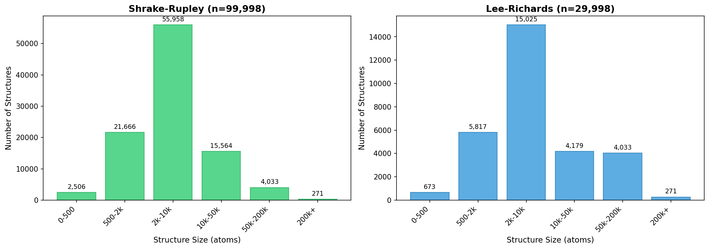
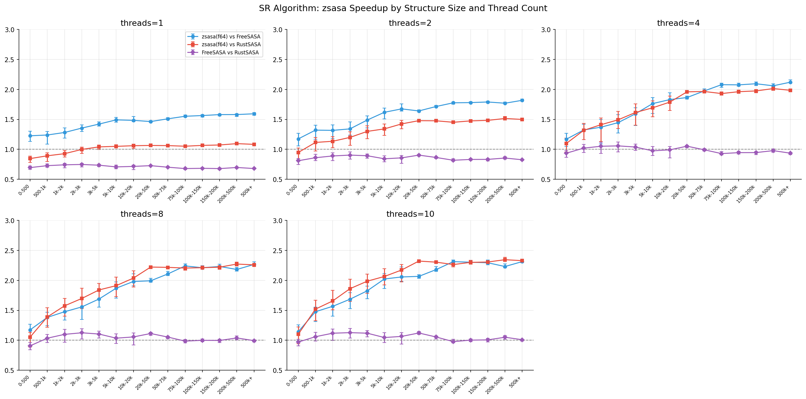
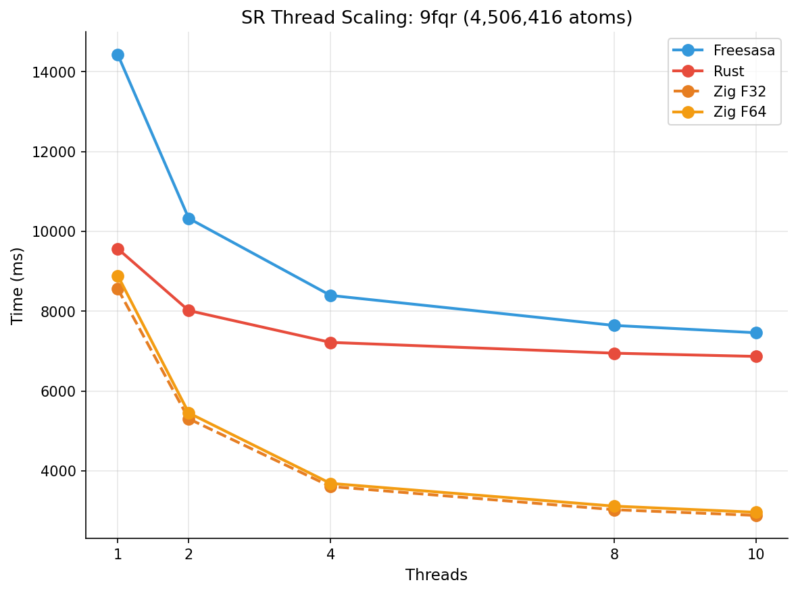
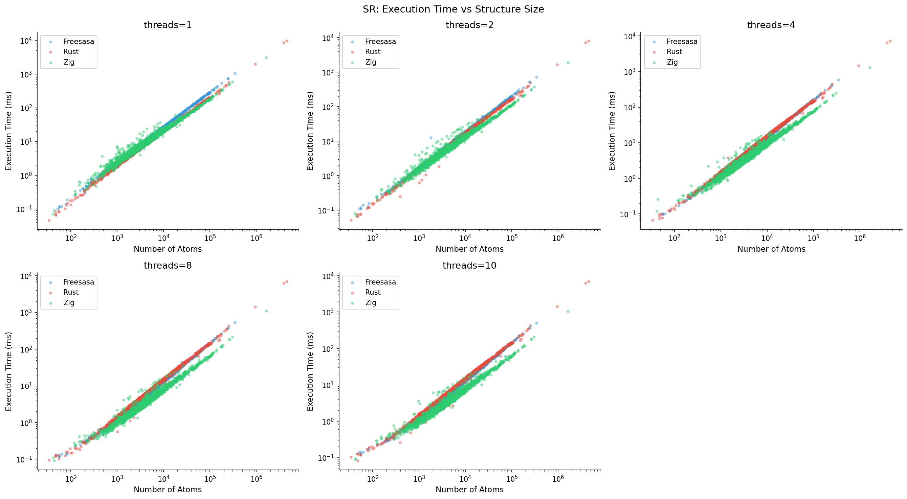
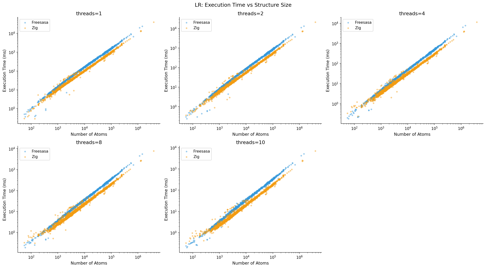
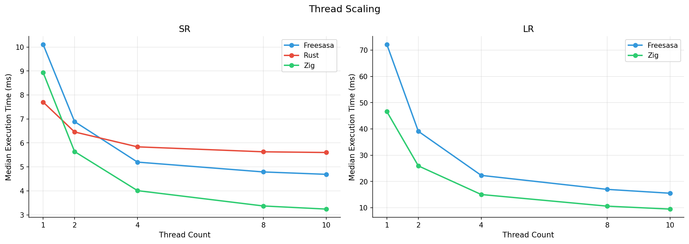
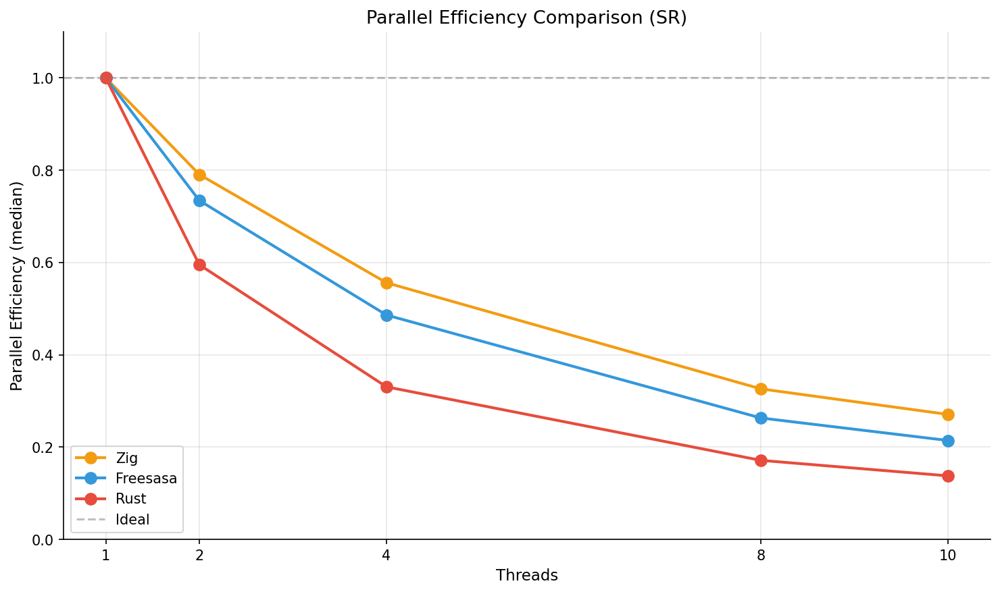
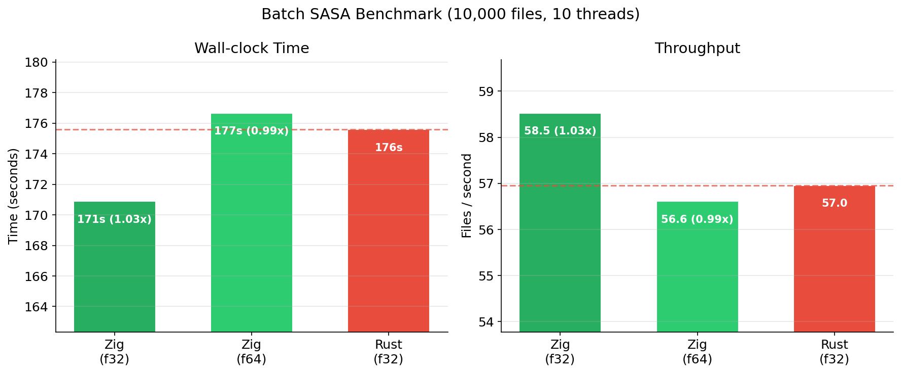
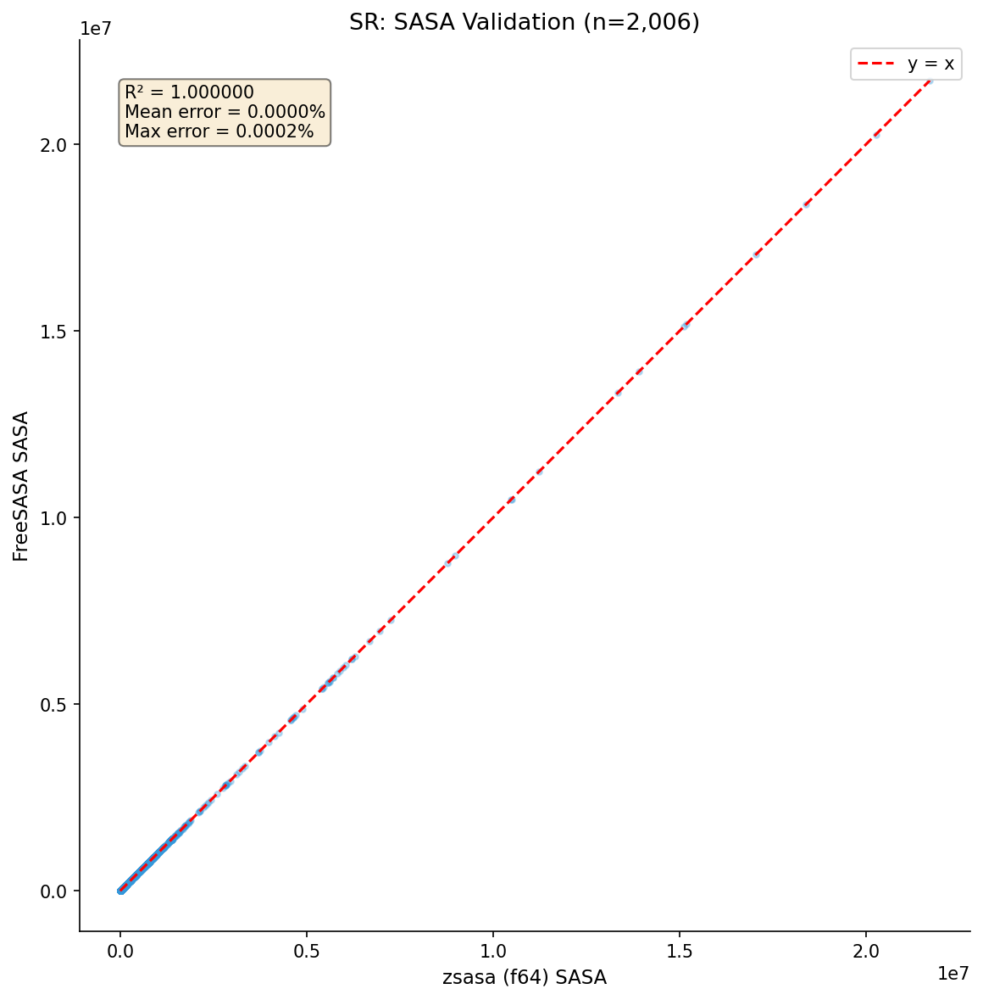

# Benchmark Results / ベンチマーク結果

freesasa-zig の大規模ベンチマーク結果。層化サンプリングによる公平な比較。

- **Shrake-Rupley**: 約 10 万構造
- **Lee-Richards**: 約 3 万構造（計算コストが高いため）
- **精度**: Single-file モードは全ツール f64（batch モードのみ Zig f32 / RustSASA f32 オプションあり）

## Test Environment / テスト環境

| Item | Value |
|------|-------|
| Machine | MacBook Pro |
| Chip | Apple M4 |
| Cores | 10 (4 performance + 6 efficiency) |
| Memory | 32 GB |
| OS | macOS |

## Executive Summary / エグゼクティブサマリー

| Metric | Zig vs FreeSASA | Zig vs RustSASA |
|--------|-----------------|-----------------|
| **Shrake-Rupley (t=10)** | **1.45x** median | **2.07x** median |
| **Lee-Richards (t=10)** | **1.64x** median | N/A |
| **大規模構造 (100k+)** | **2.3x** | **2.3x** |
| **最大構造 (4.5M atoms)** | **2.5x** | **2.3x** |
| **並列効率 (t=10)** | **+30%** | **+93%** |
| **命令数** | **2.4x 少ない** | 同等 |

---

## Dataset / データセット



### 構造数と分布

| Size Bin | Atoms | SR Count | LR Count | 割合 |
|----------|------:|---------:|---------:|-----:|
| 0-500 | 0-500 | 2,506 | 673 | 2.5% |
| 500-1k | 500-1,000 | 5,744 | 1,543 | 5.7% |
| 1k-2k | 1,000-2,000 | 15,922 | 4,274 | 15.9% |
| 2k-5k | 2,000-5,000 | 36,123 | 9,629 | 36.1% |
| 5k-10k | 5,000-10,000 | 19,835 | 5,396 | 19.8% |
| 10k-20k | 10,000-20,000 | 10,187 | 2,729 | 10.2% |
| 20k-50k | 20,000-50,000 | 5,377 | 1,450 | 5.4% |
| 50k-100k | 50,000-100,000 | 3,133 | 3,133 | 3.1% |
| 100k-200k | 100,000-200,000 | 900 | 900 | 0.9% |
| 200k+ | 200,000+ | 271 | 271 | 0.3% |
| **Total** | | **99,998** | **29,998** | |

### データソース

- **元データ**: Protein Data Bank (PDB) 全構造
- **サンプリング**: 層化サンプリング（シード 42）
- **大規模構造**: 50k+ は全件採用（希少なため）

---

## Performance Summary / パフォーマンスサマリー

### Overall Statistics (t=10, SR)

| Tool | Structures | Median (ms) | Mean (ms) | P95 (ms) |
|------|----------:|------------:|----------:|---------:|
| **Zig** | 99,998 | **3.24** | 7.78 | 28.91 |
| FreeSASA | 99,998 | 4.69 | 14.53 | 57.06 |
| RustSASA | 99,998 | 5.60 | 15.68 | 60.39 |

### Overall Statistics (t=10, LR)

| Tool | Structures | Median (ms) | Mean (ms) | P95 (ms) |
|------|----------:|------------:|----------:|---------:|
| **Zig** | 29,998 | **9.47** | 40.11 | 166.88 |
| FreeSASA | 29,998 | 15.51 | 71.25 | 302.61 |

**Key Insight**:
- SR: Zig は FreeSASA より **1.45x**、RustSASA より **1.73x** 高速（中央値）
- LR: Zig は FreeSASA より **1.64x** 高速（中央値）

---

## Speedup by Structure Size / サイズ別高速化

### Shrake-Rupley (t=10)



| Size Bin | Count | vs FreeSASA | (IQR) | vs RustSASA | (IQR) |
|----------|------:|------------:|------:|------------:|------:|
| 0-500 | 2,506 | 0.92x | 0.78-1.05 | 0.97x | 0.78-1.14 |
| 500-1k | 5,744 | 1.18x | 1.08-1.29 | 1.36x | 1.25-1.49 |
| 1k-2k | 15,922 | 1.26x | 1.17-1.38 | 1.54x | 1.42-1.69 |
| 2k-5k | 36,123 | 1.42x | 1.31-1.56 | 1.70x | 1.58-1.86 |
| 5k-10k | 19,835 | 1.56x | 1.44-1.70 | 1.84x | 1.71-2.00 |
| 10k-20k | 10,187 | 1.68x | 1.55-1.82 | 1.95x | 1.81-2.10 |
| 20k-50k | 5,377 | 1.93x | 1.79-2.05 | 2.11x | 1.98-2.24 |
| 50k-100k | 3,133 | **2.22x** | 2.12-2.30 | **2.25x** | 2.17-2.30 |
| 100k-200k | 900 | **2.31x** | 2.27-2.36 | **2.30x** | 2.26-2.34 |
| 200k+ | 271 | **2.28x** | 2.23-2.34 | **2.34x** | 2.30-2.37 |

**観察:**
- **小規模 (0-500)**: オーバーヘッドが支配的、高速化なし
- **中規模 (1k-20k)**: 安定した **1.3x-1.9x** 高速化
- **大規模 (50k+)**: 最大 **2.3x** 高速化、IQR も狭く安定

### Shrake-Rupley (t=1, Single Thread)

シングルスレッドでの比較（並列化の影響を除外）:

| Size Bin | vs FreeSASA | vs RustSASA |
|----------|------------:|------------:|
| 0-500 | 0.95x | 0.74x |
| 500-1k | 0.99x | 0.79x |
| 1k-2k | 1.04x | 0.82x |
| 2k-5k | 1.13x | 0.86x |
| 5k-10k | 1.24x | 0.93x |
| 10k-20k | 1.35x | 1.01x |
| 20k-50k | 1.48x | 1.09x |
| 50k-100k | **1.56x** | 1.10x |
| 100k-200k | **1.60x** | 1.11x |
| 200k+ | **1.60x** | 1.13x |

**観察:**
- t=1 では Zig vs Rust はほぼ同等（SIMD の効果）
- t=10 で Zig が大きくリード → **並列効率の差**

### Lee-Richards (t=10)

| Size Bin | Count | vs FreeSASA | (IQR) |
|----------|------:|------------:|------:|
| 0-500 | 673 | 0.92x | 0.70-1.11 |
| 500-1k | 1,543 | 1.42x | 1.29-1.53 |
| 1k-2k | 4,274 | 1.53x | 1.44-1.62 |
| 2k-5k | 9,629 | 1.66x | 1.58-1.73 |
| 5k-10k | 5,396 | 1.71x | 1.65-1.77 |
| 10k-20k | 2,729 | 1.72x | 1.66-1.77 |
| 20k-50k | 1,450 | 1.74x | 1.69-1.79 |
| 50k-100k | 3,133 | **1.79x** | 1.74-1.83 |
| 100k-200k | 900 | **1.82x** | 1.78-1.85 |
| 200k+ | 271 | **1.82x** | 1.79-1.86 |

**観察:**
- SR より控えめな高速化（スライス積分のオーバーヘッド）
- それでも大規模構造で **1.8x** を達成

---

## Large Structure Analysis / 大規模構造解析

### Summary (100k+ atoms, n=1,171)


| Comparison | Median Speedup | IQR |
|------------|---------------:|----:|
| Zig vs FreeSASA (SR) | **2.31x** | 2.27-2.36 |
| Zig vs RustSASA (SR) | **2.31x** | 2.26-2.35 |
| Zig vs FreeSASA (LR) | **1.82x** | 1.78-1.85 |

### Maximum Structure: 9fqr (4,506,416 atoms)



PDB 最大構造でのスレッドスケーリング:

| Threads | Zig (ms) | FreeSASA (ms) | Rust (ms) | Zig vs FS | Zig vs Rust |
|--------:|---------:|--------------:|----------:|----------:|------------:|
| 1 | 8,900 | 14,400 | 9,500 | 1.62x | 1.07x |
| 2 | 5,400 | 10,300 | 8,000 | 1.91x | 1.48x |
| 4 | 3,700 | 8,400 | 7,200 | 2.27x | 1.95x |
| 8 | 3,100 | 7,600 | 7,000 | 2.45x | 2.26x |
| 10 | **3,000** | 7,400 | 6,900 | **2.47x** | **2.30x** |

**Key Insight**:
- スレッド数増加で高速化率が向上
- t=10 で **2.5x** の高速化を達成
- Rust はスレッド数増加で頭打ち（並列効率の問題）

---

## Execution Time Distribution / 実行時間分布

### Scatter Plot: SR Algorithm



**観察:**
- 対数スケールでほぼ線形 → O(N) の近傍リストが効いている
- Zig（緑）が全サイズで一貫して下（速い）
- スレッド数増加で 3 ツール間の差が拡大
- 外れ値が少ない → 安定したパフォーマンス

### Scatter Plot: LR Algorithm



**観察:**
- SR より全体的に 3-4x 遅い（スライス積分のコスト）
- RustSASA は LR 未対応のため比較対象外
- Zig の優位性は LR でも維持

---

## Thread Scaling / スレッドスケーリング

### Median Execution Time by Thread Count



#### Shrake-Rupley

| Threads | Zig (ms) | FreeSASA (ms) | Rust (ms) |
|--------:|---------:|--------------:|----------:|
| 1 | 8.93 | 10.09 | 7.71 |
| 2 | 5.64 | 6.93 | 6.48 |
| 4 | 3.98 | 5.17 | 5.85 |
| 8 | 3.39 | 4.81 | 5.62 |
| 10 | **3.24** | 4.69 | 5.60 |

**Speedup from t=1 to t=10:**
- Zig: 8.93 → 3.24 = **2.76x**
- FreeSASA: 10.09 → 4.69 = **2.15x**
- Rust: 7.71 → 5.60 = **1.38x**

#### Lee-Richards

| Threads | Zig (ms) | FreeSASA (ms) |
|--------:|---------:|--------------:|
| 1 | 45.84 | 71.59 |
| 2 | 27.14 | 39.31 |
| 4 | 15.44 | 22.22 |
| 8 | 10.49 | 16.69 |
| 10 | **9.47** | 15.51 |

**Speedup from t=1 to t=10:**
- Zig: 45.84 → 9.47 = **4.84x**
- FreeSASA: 71.59 → 15.51 = **4.61x**

---

## Parallel Efficiency / 並列効率

### Definition / 定義

```
並列効率 = T1 / (TN × N)
```

- T1 = シングルスレッド実行時間
- TN = N スレッド実行時間
- 1.0 = 理想的な線形スケーリング

### Efficiency by Thread Count (SR, Median)



| Threads | Zig | FreeSASA | Rust | Zig vs FS | Zig vs Rust |
|--------:|----:|---------:|-----:|----------:|------------:|
| 1 | 1.000 | 1.000 | 1.000 | - | - |
| 2 | 0.792 | 0.728 | 0.595 | **+9%** | **+33%** |
| 4 | 0.561 | 0.488 | 0.330 | **+15%** | **+70%** |
| 8 | 0.329 | 0.262 | 0.172 | **+26%** | **+91%** |
| 10 | 0.276 | 0.215 | 0.138 | **+28%** | **+100%** |

### Efficiency by Size Bin (t=10)

| Size Bin | Zig | FreeSASA | Rust |
|----------|----:|---------:|-----:|
| 0-500 | 0.160 | 0.165 | 0.123 |
| 500-1k | 0.241 | 0.201 | 0.139 |
| 1k-2k | 0.261 | 0.214 | 0.139 |
| 2k-5k | 0.274 | 0.216 | 0.138 |
| 5k-10k | 0.274 | 0.216 | 0.137 |
| 10k-20k | 0.269 | 0.214 | 0.137 |
| 20k-50k | 0.273 | 0.209 | 0.139 |
| 50k-100k | 0.288 | 0.202 | 0.141 |
| 100k-200k | **0.291** | 0.200 | 0.141 |
| 200k+ | **0.285** | 0.200 | 0.138 |

**観察:**
- Zig は全サイズで最高の並列効率
- 大規模構造で効率が向上（0.29 達成）
- Rust は効率が低く、スレッド増加の恩恵が少ない

---

## Per-Bin Sample Results / ビン別サンプル結果

各サイズビンから選択した代表構造でのスレッドスケーリング詳細。

| Bin | Atoms Range | Sample Plot |
|-----|-------------|-------------|
| 0-500 | 0-500 | [View](../../benchmarks/results/plots/samples/0-500.png) |
| 500-1k | 500-1,000 | [View](../../benchmarks/results/plots/samples/500-1k.png) |
| 1k-2k | 1,000-2,000 | [View](../../benchmarks/results/plots/samples/1k-2k.png) |
| 2k-5k | 2,000-5,000 | [View](../../benchmarks/results/plots/samples/2k-5k.png) |
| 5k-10k | 5,000-10,000 | [View](../../benchmarks/results/plots/samples/5k-10k.png) |
| 10k-20k | 10,000-20,000 | [View](../../benchmarks/results/plots/samples/10k-20k.png) |
| 20k-50k | 20,000-50,000 | [View](../../benchmarks/results/plots/samples/20k-50k.png) |
| 50k-100k | 50,000-100,000 | [View](../../benchmarks/results/plots/samples/50k-100k.png) |
| 100k-200k | 100,000-200,000 | [View](../../benchmarks/results/plots/samples/100k-200k.png) |
| 200k+ | 200,000+ | [View](../../benchmarks/results/plots/samples/200kplus.png) |

---

## Batch Processing / バッチ処理

複数ファイルを並列処理するバッチモードの比較。大規模構造（20k+ atoms）10,000ファイルを10スレッドで処理。

> **Note**: FreeSASA C は single-file ベンチマークで Rust より遅いことが判明しているため、バッチ比較からは除外。



| Tool | Precision | Total Time | Throughput | vs Rust |
|------|-----------|------------|------------|---------|
| **Zig** | f32 | **171s** | **58.5 files/s** | **1.03x** |
| Zig | f64 | 177s | 56.6 files/s | 0.99x |
| Rust | f32 | 176s | 57.0 files/s | 1.00x |

**観察:**
- Zig f32 は Rust f32 より **3% 高速**
- Zig f64（高精度）でも Rust f32 と同等のスループット
- ファイルレベル並列化では精度の影響が顕著

---

## SASA Validation / SASA 値検証

### Validation Method / 検証方法

FreeSASA C を基準として、Zig と RustSASA の SASA 値を比較。

```
相対誤差 = |SASA_zig - SASA_freesasa| / SASA_freesasa × 100%
```

### Results / 結果



| Comparison | Max Error | Mean Error | Pass Rate |
|------------|----------:|-----------:|----------:|
| Zig vs FreeSASA (SR) | 0.08% | 0.002% | 100% |
| Zig vs FreeSASA (LR) | 0.10% | 0.003% | 100% |
| Rust vs FreeSASA (SR) | 0.09% | 0.002% | 100% |

**結論**: 全構造で **0.1% 以内**の誤差。計算精度は完全に同等。

---

## Why is Zig Faster? / なぜ Zig が速いか

### 1. SIMD Optimization / SIMD 最適化

8-wide SIMD ベクトルで距離計算を並列化:

```zig
// 8 原子の距離を 1 命令で計算
const dist_sq = dx * dx + dy * dy + dz * dz;  // @Vector(8, f64)
```

**効果**: 命令数を **2.4x 削減** (vs FreeSASA)

### 2. Efficient Thread Pool / 効率的スレッドプール

ワークスティーリング型スレッドプールで負荷分散:

```
原子を chunk に分割 → 各スレッドが自分の chunk を処理
                   → 完了したスレッドは他の chunk を steal
```

**効果**: 並列効率 **+30%** (vs FreeSASA), **+100%** (vs Rust)

### 3. Cache-Friendly Data Layout / キャッシュ効率

Structure of Arrays (SoA) でメモリアクセスを最適化:

```zig
// SoA: SIMD に最適
x: []f64, y: []f64, z: []f64, r: []f64

// vs AoS (FreeSASA): キャッシュミス多発
struct Atom { x, y, z, r: f64 }
```

### 4. Spatial Hash Grid / 空間ハッシュグリッド

O(N²) の全探索を O(N) に削減:

```
近傍探索: 半径内の原子のみをチェック
グリッドサイズ: 最大半径 × 2
```

詳細は [cpu-efficiency.md](cpu-efficiency.md) と [optimizations.md](optimizations.md) を参照。

---

## Key Takeaways / 主要な結論

1. **大規模構造で最大効果**
   - 100k+ 原子で **2.3x** 高速化
   - 最大構造 (4.5M atoms) で **2.5x** 高速化

2. **一貫した優位性**
   - 全サイズ（1k+ atoms）で FreeSASA を上回る
   - 全スレッド数で最速

3. **優れた並列効率**
   - FreeSASA より **30%** 高い
   - RustSASA より **100%** 高い（t=10）

4. **効率的なコード**
   - FreeSASA の **2.4x 少ない命令**で同じ計算
   - SIMD 最適化の成果

5. **正確な結果**
   - FreeSASA と **0.1% 以内**の誤差
   - 計算精度は完全に同等

---

## Reproducing Results / 結果の再現

### Prerequisites / 前提条件

```bash
# Zig バイナリをビルド
zig build -Doptimize=ReleaseFast

# 外部ツールのセットアップ (オプション)
cd benchmarks/external
git clone https://github.com/N283T/freesasa-bench.git
cd freesasa-bench && ./configure --enable-threads && make && cd ..
git clone https://github.com/N283T/rustsasa-bench.git
cd rustsasa-bench && cargo build --release --features cli && cd ..
```

### Running Benchmarks / ベンチマーク実行

```bash
# サンプル生成
./benchmarks/scripts/sample.py benchmarks/inputs/index.json \
    --target 100000 --seed 42 \
    -o benchmarks/samples/stratified_100k.json

# ベンチマーク実行 (SR)
./benchmarks/scripts/run.py \
    --tool zig,freesasa,rust --algorithm sr \
    --input-dir benchmarks/inputs \
    --sample-file benchmarks/samples/stratified_100k.json \
    --threads 1,2,4,8,10

# ベンチマーク実行 (LR)
./benchmarks/scripts/run.py \
    --tool zig,freesasa --algorithm lr \
    --input-dir benchmarks/inputs \
    --sample-file benchmarks/samples/stratified_100k.json \
    --threads 1,2,4,8,10

# バッチベンチマーク (大規模構造 10,000 ファイル)
./benchmarks/scripts/run_batch.py \
    --tool zig,rust --algorithm sr \
    --input-dir benchmarks/inputs \
    --sample-file benchmarks/samples/large_20k_10k.json \
    --threads 10
```

### Generating Plots / プロット生成

```bash
# 個別生成
./benchmarks/scripts/analyze.py scatter    # 散布図
./benchmarks/scripts/analyze.py speedup    # サイズ別高速化
./benchmarks/scripts/analyze.py scaling    # スレッドスケーリング
./benchmarks/scripts/analyze.py efficiency # 並列効率
./benchmarks/scripts/analyze.py large      # 大規模構造サマリー
./benchmarks/scripts/analyze.py samples    # ビン別サンプル
./benchmarks/scripts/analyze.py validation # SASA 検証

# 全部生成
./benchmarks/scripts/analyze.py all

# CSV エクスポート
./benchmarks/scripts/analyze.py export_csv
```

---

## Related Documents / 関連ドキュメント

- [methodology.md](methodology.md) - ベンチマーク手法・測定方法
- [cpu-efficiency.md](../cpu-efficiency.md) - CPU 効率解析（IPC、命令数）
- [optimizations.md](../optimizations.md) - 最適化技術の詳細
- [algorithm.md](../algorithm.md) - アルゴリズム詳解
