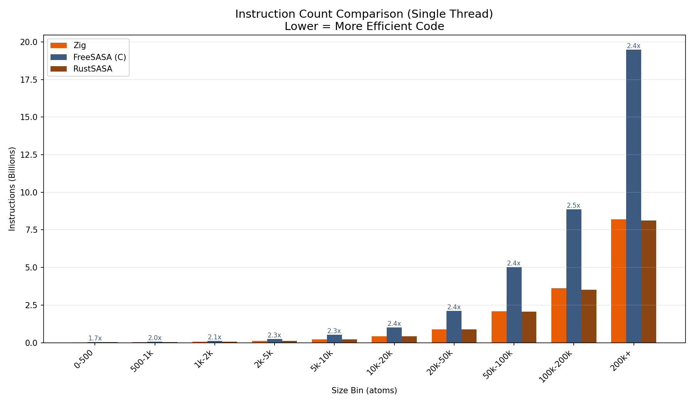
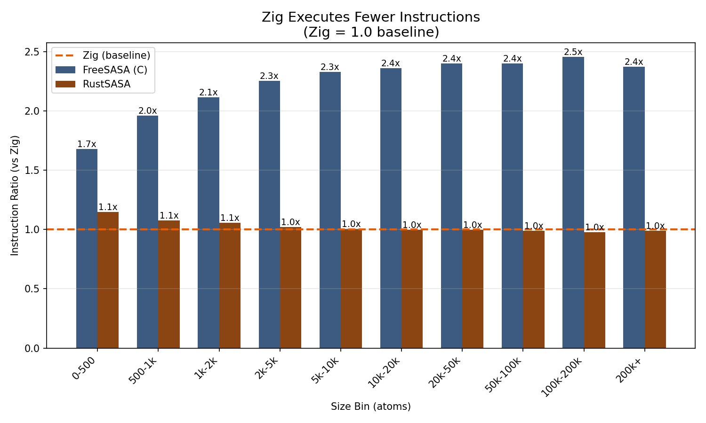
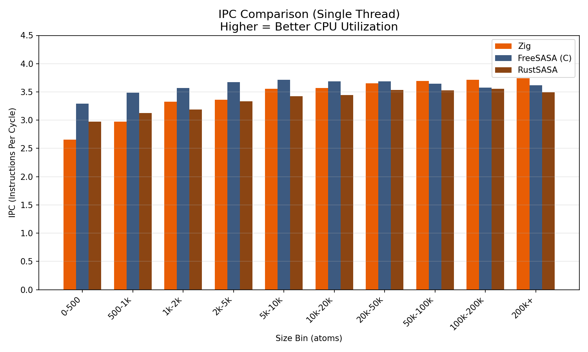

# CPU Efficiency Analysis

Analysis of zsasa's CPU-level efficiency. Measures not just execution time but **instruction count** and **IPC** to reveal "why it's fast".

## Key Findings

| Metric | Zig vs FreeSASA | Zig vs RustSASA |
|--------|-----------------|-----------------|
| **Instruction count** | **2.4x fewer** | Comparable |
| **IPC (t=1)** | Slightly lower | Comparable |
| **IPC (t=10)** | Comparable | **More stable** |
| **Parallel efficiency** | **30-45% higher** | **2x higher** |

**Conclusion**: Zig halves instruction count through SIMD optimization and maintains parallel efficiency with an efficient thread pool.

## Metrics

### IPC (Instructions Per Cycle)

```
IPC = Instructions executed / CPU cycles
```

- **High IPC** = Efficient CPU pipeline utilization
- Modern CPUs ideally achieve IPC 3.0-4.0
- Low IPC suggests memory waits, branch mispredictions, or dependency stalls

### Instruction Count

```
Instruction count = Total CPU instructions needed for the same computation
```

- **Fewer instructions** = More efficient code
- SIMD processes multiple data with one instruction, reducing instruction count

### Parallel Efficiency

```
Parallel Efficiency = T1 / (TN × N)
```

- T1 = Single-thread execution time
- TN = N-thread execution time
- 1.0 = Ideal (linear scaling)

## Methodology

### IPC Measurement

Using macOS `/usr/bin/time -l`:

```bash
/usr/bin/time -l ./zsasa --algorithm=sr input.json output.json
```

Extract `instructions retired` and `cycles elapsed` from output:

```
       8216482889  instructions retired
       2189180558  cycles elapsed
```

### Test Subjects

One representative structure selected from each size bin (median size):

| Bin | Atoms | PDB ID |
|-----|------:|--------|
| 0-500 | 277 | 2ljq |
| 500-1k | 812 | 6c51 |
| 1k-2k | 1,496 | 7ngi |
| 2k-5k | 3,078 | 2o0z |
| 5k-10k | 6,764 | 7xhw |
| 10k-20k | 13,225 | 4be7 |
| 20k-50k | 28,076 | 4kvm |
| 50k-100k | 67,015 | 7pt7 |
| 100k-200k | 120,748 | 5t9r |
| 200k+ | 252,840 | 6u0r |

## Results

### Instruction Count Comparison



**Single Thread (t=1):**

| Size Bin | Zig | FreeSASA | Rust | FS/Zig |
|----------|----:|---------:|-----:|-------:|
| 0-500 | 0.02B | 0.04B | 0.03B | 1.7x |
| 500-1k | 0.04B | 0.08B | 0.04B | 2.0x |
| 1k-2k | 0.06B | 0.13B | 0.06B | 2.1x |
| 2k-5k | 0.11B | 0.25B | 0.11B | 2.3x |
| 5k-10k | 0.23B | 0.53B | 0.23B | 2.3x |
| 10k-20k | 0.43B | 1.01B | 0.43B | 2.4x |
| 20k-50k | 0.88B | 2.12B | 0.88B | 2.4x |
| 50k-100k | 2.10B | 5.04B | 2.07B | 2.4x |
| 100k-200k | 3.61B | 8.87B | 3.53B | 2.5x |
| 200k+ | 8.22B | 19.50B | 8.12B | 2.4x |

**Key insight**: Zig completes the same computation with **~2.4x fewer instructions** than FreeSASA.

### Instruction Ratio



Relative comparison with Zig as 1.0:
- **FreeSASA**: 1.7x - 2.5x (average 2.3x)
- **RustSASA**: 1.0x - 1.1x (nearly identical)

### IPC Comparison



**Single Thread (t=1):**

| Size Bin | Zig | FreeSASA | Rust |
|----------|----:|---------:|-----:|
| 0-500 | 2.66 | 3.29 | 2.97 |
| 500-1k | 2.97 | 3.49 | 3.12 |
| 5k-10k | 3.56 | 3.72 | 3.42 |
| 50k-100k | 3.69 | 3.65 | 3.53 |
| 200k+ | 3.75 | 3.62 | 3.49 |

**Observations:**
- Small structures: FreeSASA has higher IPC
- Large structures: Zig's IPC catches up (SIMD effect more pronounced)

### Multi-thread IPC (t=10)

| Size Bin | Zig | FreeSASA | Rust |
|----------|----:|---------:|-----:|
| 0-500 | 2.69 | 3.16 | **2.04** |
| 500-1k | 2.80 | 3.26 | **2.22** |
| 5k-10k | 3.16 | 3.48 | 3.03 |
| 200k+ | 3.29 | 3.44 | 3.33 |

**Observations:**
- Rust's IPC drops significantly for small structures (thread synchronization overhead)
- Zig maintains relatively stable IPC

## Analysis

### Why Fewer Instructions?

**SIMD (Single Instruction Multiple Data)**

Zig parallelizes distance calculations with 8-wide SIMD vectors:

```zig
// Calculate distance for 8 atoms with 1 instruction
const dx = atom_x - @as(@Vector(8, f64), neighbor_x);
const dy = atom_y - @as(@Vector(8, f64), neighbor_y);
const dz = atom_z - @as(@Vector(8, f64), neighbor_z);
const dist_sq = dx * dx + dy * dy + dz * dz;
```

FreeSASA uses scalar operations:

```c
// Calculate distance for 1 atom with 1 instruction
double dx = atom->x - neighbor->x;
double dy = atom->y - neighbor->y;
double dz = atom->z - neighbor->z;
double dist_sq = dx*dx + dy*dy + dz*dz;
```

### Why Not 8x Fewer?

SIMD provides 8x parallelization, but instruction count only decreases by 2.4x because:

```
SASA calculation breakdown:
├── Distance calculation (SIMD-able)  : ~65%  → 8x speedup
├── Neighbor list lookup              : ~15%  → SIMD not applicable (many branches)
├── Loop control/branching            : ~10%  → SIMD not applicable
└── Memory read/write                 : ~10%  → Limited SIMD benefit
```

Calculation: `35% + 65%/8 = 35% + 8% = 43%` → **~2.3x difference** (matches measurement)

This is a classic example of **Amdahl's Law**.

### Why Lower IPC?

SIMD instructions "do more work per instruction" but are complex and take multiple cycles:

| Instruction type | Count | Cycles/instr | Work/instr |
|------------------|------:|-------------:|-----------:|
| Scalar | Many | 1 | 1 |
| SIMD | Few | 2-3 | 8 |

IPC decreases, but **total cycles decrease** → speedup.

### Why Is Rust Slower Despite Same Instruction Count?

Rust also uses SIMD so instruction count is similar to Zig. However:

1. **Thread synchronization overhead**: rayon's work-stealing is inefficient for fine-grained tasks
2. **IPC drops for small structures**: IPC falls to 2.0 at t=10 (Zig maintains 2.7)
3. **Parallel efficiency difference**: Zig's thread pool has more efficient work distribution

## Running the Analysis

```bash
# Run IPC benchmark
./benchmarks/scripts/ipc.py --tools zig,freesasa,rust --threads 1,10

# Generate plots
./benchmarks/scripts/ipc.py plot

# Results
# → benchmarks/results/ipc/results.csv
# → benchmarks/results/ipc/instructions.png
# → benchmarks/results/ipc/instruction_ratio.png
# → benchmarks/results/ipc/ipc.png
```

## Summary

| Optimization | Effect | Target |
|--------------|--------|--------|
| **8-wide SIMD** | 2.4x fewer instructions | vs FreeSASA |
| **Efficient thread pool** | 2x better parallel efficiency | vs RustSASA |
| **Stable IPC** | Maintains efficiency in multi-threaded | vs RustSASA |

**Conclusion**: zsasa is not just "fast" but uses CPU resources efficiently.
